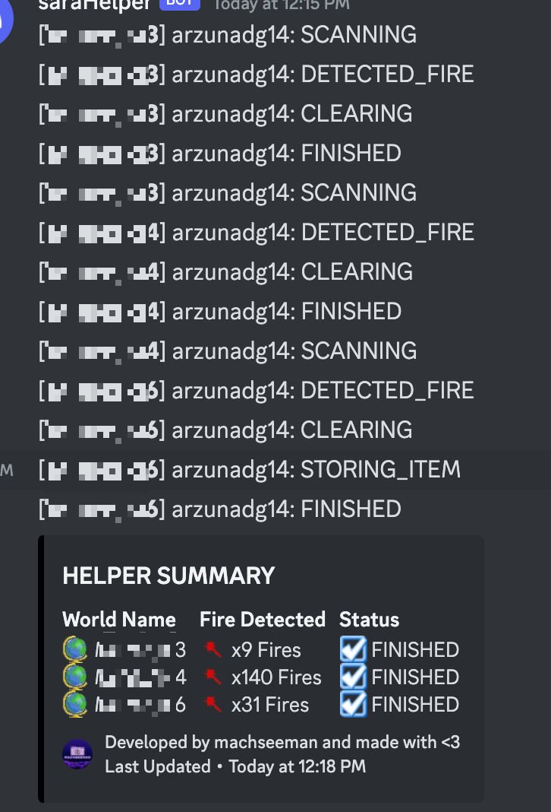

### saraHelper

Make the bot do some automations to clean your world!

---

<p align = 'center'>  </p>

If you need help implementing this, feels free to dm me at discord junssekut#4964 or join my [discord server](https://dsc.gg/machseeman).

## Output
> The output of the script would be:



## How To Use

> Creating your custom config:
```lua
local config = {
    --- World list that has fire inside them use : to specify door id, example: world:doorid.
    worlds = {
        'world1',
        'world2:doorid'
    },

    --- Optional to use if you want to take fire hose from another world.
    storage = 'storage:doorid',

    --- Optional to use door id if you don't specify the door id manually per worlds.
    id = '',

    --- Webhook URL to send the information of any activities.
    webhook = ''
}
```

> Add this code inside your script (online fetch):
```lua
--- Fetch the online script and load it.
local saraHelper = assert(load(request('GET', 'https://raw.githubusercontent.com/junssekut/saraHelper/main/src/saraHelper-src.lua'))())

--- Initialize with your custom config!
local status, message = pcall(saraHelper.init, config)

if not status then error('An error occured, please see error_logs.txt\n' .. message) end
```

> Add this code inside your script if you want it offline or locally ( not recommended, since you won't get any updates or fixes ):
```lua
--- 'saraHelper.lua' must be the same folder as Pandora.
local saraHelper = require('saraHelper')

--- Initialize with your custom config!
local status, message = pcall(saraHelper.init, config)

if not status then error('An error occured, please see error_logs.txt\n' .. message) end
```
